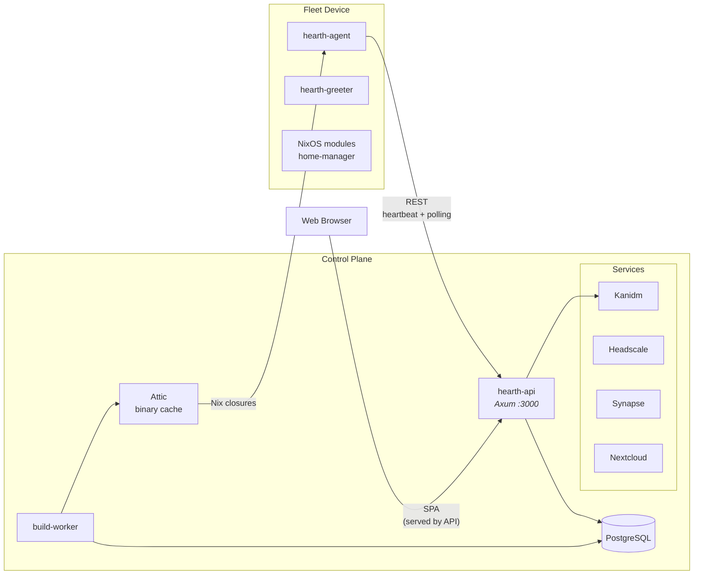

# Hearth

**Enterprise NixOS desktop fleet management platform.**

Hearth manages device enrollment, configuration deployment, software catalog, and user environments across a fleet of NixOS workstations. It pairs a Rust control plane with NixOS modules and a web-based admin console to give IT teams declarative, reproducible desktop management.

## Why Hearth?

Enterprise Linux desktop management today means stitching together SCCM-like tools that were never designed for immutable, declarative systems. NixOS solves the reproducibility problem at the OS level, but there's nothing that manages a *fleet* of NixOS desktops end-to-end: enrollment, identity, configuration rollout, software requests, and observability.

Hearth fills that gap:

- **Declarative fleet state** -- target configurations are Nix expressions; the agent converges each machine toward its desired state
- **Role-based desktop profiles** -- home-manager profiles for developer, designer, admin, and default roles, applied automatically via identity group membership
- **Integrated collaboration stack** -- Kanidm (identity), Matrix/Synapse (chat), Nextcloud (files/calendar), Headscale (mesh VPN), all deployable as a single Helm chart
- **Binary cache-backed deployments** -- builds go through Attic so fleet devices pull pre-built closures, not source evaluations
- **Software catalog & request workflow** -- end users browse and request software; admins approve; the build worker produces the closure and the agent installs it
- **Compliance engine** -- policy evaluation, audit trail, and reporting built into the control plane

## Architecture at a Glance



## Prerequisites

- **Nix** with flakes enabled (`nix.settings.experimental-features = [ "nix-command" "flakes" ];`)
- **Docker** and **Docker Compose** (for local infrastructure: PostgreSQL, Kanidm, Attic, Synapse, Nextcloud, etc.)
- ~10 GB free disk space, ~8 GB RAM for all services

All other tooling (Rust toolchain, pnpm, sqlx-cli, Helm, etc.) is provided by the Nix dev shell.

## Getting Started

### Enter the dev shell

```bash
nix develop
```

This gives you the Rust toolchain, sqlx-cli, pnpm, Node.js, GTK4 libs, and everything else needed to build and develop.

### One-time setup

```bash
just setup
```

This starts all infrastructure containers (PostgreSQL, Kanidm, Attic, Synapse, Nextcloud, Grafana, Headscale), runs database migrations, bootstraps identity and collaboration services, and builds the web frontend.

### Run the demo environment

```bash
just demo
```

Seeds the database with example machines, users, and deployments, then starts the API server. See `docs/DEMO.md` for walkthrough scenarios and test accounts.

**Demo service URLs:**

| Service | URL |
|---|---|
| Hearth Web UI | http://localhost:3000 |
| Kanidm (IdP) | https://localhost:8443 |
| Element Chat | http://localhost:8088 |
| Nextcloud | http://localhost:8089 |
| Grafana | http://localhost:3001 |

**Test accounts:** `testadmin` / `test-demo-enrollment` (admin), `testuser` / `test-demo-enrollment` (user)

### Day-to-day development

```bash
just dev          # Start API server (loads Kanidm auth config)
just worker       # Start build worker
just web-dev      # Vite dev server on :5174
just check        # clippy + fmt + tests
just              # List all available recipes
```

### Kubernetes deployment (Kind)

```bash
just helm-up      # Create Kind cluster + deploy Hearth Home Cluster
just helm-status  # Show pod/svc/pvc status
just helm-forward # Port-forward API to localhost:3000
just helm-down    # Tear down cluster
```

For full capabilities (identity, mesh, builds, chat, cloud):

```bash
just helm-up-full
```

### NixOS VM integration tests

```bash
nix flake check                                          # Run all checks including VM tests
nix build .#checks.x86_64-linux.vm-agent-heartbeat       # Run a single VM test
```

## Project Structure

```
crates/               Rust workspace
  hearth-common/        Shared types, API client, config
  hearth-agent/         On-device agent (systemd service)
  hearth-api/           Control plane REST API (Axum)
  hearth-build-worker/  Nix build job queue worker
  hearth-greeter/       GTK4 greetd greeter (stub)
  hearth-enrollment/    ratatui TUI for device enrollment (stub)
web/                  Frontend (pnpm monorepo)
  packages/ui/          @hearth/ui — design system + components
  apps/hearth/          @hearth/web — unified SPA (React 19, TanStack Router)
modules/              NixOS modules (agent, desktop, identity, hardening, etc.)
home-modules/         Home-manager role profiles
chart/hearth-home/    Helm chart for control plane deployment
tests/                NixOS VM integration tests (QEMU)
migrations/           PostgreSQL migrations (sqlx)
```

## License

AGPL-3.0-or-later
