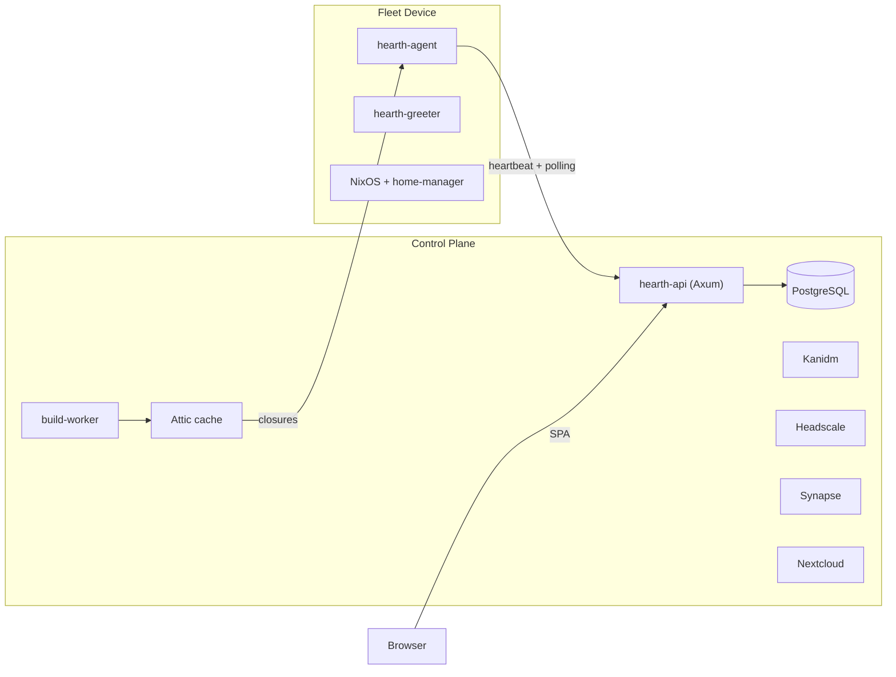

# Hearth

Fleet management for NixOS desktops. Enrollment, configuration deployment, software catalog, identity, and collaboration — managed from a single control plane.

> **Status:** Early development. Core agent polling, heartbeat, build pipeline, web console, and Helm deployment work end-to-end. Some components (greeter, enrollment TUI) are stubs.

## What it does

A Rust agent on each NixOS machine polls the control plane for its target state — NixOS closure, home-manager role profile, Flatpak packages — and converges toward it. Builds go through [Attic](https://github.com/zhaofengli/attic) so devices pull pre-built closures from a binary cache rather than evaluating Nix expressions locally.

The control plane bundles the services an org actually needs behind a capabilities toggle in a single Helm chart: [Kanidm](https://kanidm.com) for identity, [Headscale](https://github.com/juanfont/headscale) for mesh VPN, [Matrix/Synapse](https://matrix.org) for chat, [Nextcloud](https://nextcloud.com) for files and calendars, plus Grafana/Loki/Prometheus for observability.



## Getting started

You need **Nix** (with flakes) and **Docker Compose**. Everything else comes from the dev shell.

```bash
nix develop        # enter dev shell
just setup         # start containers, run migrations, bootstrap services, build frontend
just dev           # start API server on :3000
```

Run `just` to see all available recipes. `just demo` seeds sample data and starts the server — see [`docs/DEMO.md`](docs/DEMO.md) for walkthrough scenarios and test accounts.

### Common commands

```bash
just check         # clippy + fmt + tests
just web-dev       # Vite dev server on :5174
just worker        # start build worker
just helm-up       # deploy to a local Kind cluster
nix flake check    # full CI (includes NixOS VM integration tests)
```

## License

[AGPL-3.0-or-later](LICENSE)
